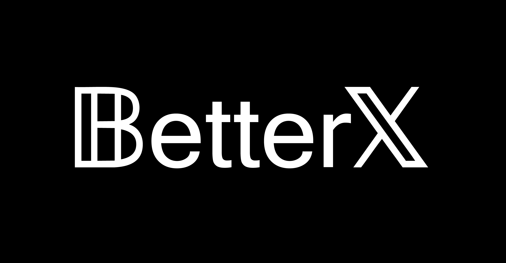

<p align="center">
  
</p>

<p align="center">
  <strong>Enhance your X experience.</strong><br>
  A modular plugin system for X (formerly Twitter) - available as a browser extension and a desktop app.
</p>

<p align="center">
  <a href="#installation">Installation</a> &bull;
  <a href="#plugins">Plugins</a> &bull;
  <a href="#development">Development</a> &bull;
  <a href="#creating-a-plugin">Create a Plugin</a> &bull;
  <a href="#contributing">Contributing</a>
</p>

---

## Installation

### Browser Extension

> Chrome Web Store and Firefox Add-ons listings coming soon.

**Manual install (Chrome/Chromium):**

1. Clone and build (see [Development](#development))
2. Go to `chrome://extensions`, enable **Developer mode**
3. Click **Load unpacked** and select `packages/extension/dist`

### Desktop App

Download the latest release for your platform:

| Platform | Formats |
|----------|---------|
| **Windows** | `.exe` installer, portable |
| **Linux** | AppImage, `.deb` |
| **macOS** | `.dmg` (ARM & x64) |

The desktop app includes everything the extension offers, plus exclusive features like Discord Rich Presence, system tray integration, window transparency, and auto-updates.

---

## Plugins

BetterX ships with many plugins - all toggleable at runtime from the settings panel. Here are some highlights:

- **AdBlocker** - hide sponsored posts and ads from your feed
- **BringTwitterBack** - revert X branding back to Twitter (logo, buttons, labels)
- **FixUpX** - auto-convert copied tweet URLs to FixupX / vxTwitter embeds
- **GifFavorites** - add a favorites category to the GIF picker, like Discord
- **MeowAd** - replace ads with cute cats :3
- **QuickEmoji** - Discord-style `:emoji:` syntax in the tweet composer
- **TweetScreenshot** - one-click screenshot button on every tweet

...and more. Open the BetterX settings panel to browse and configure all of them.

---

## Development

### Prerequisites

- [Bun](https://bun.sh) (package manager & runtime)
- [Node.js](https://nodejs.org) 20+ (for Electron)

### Setup

```bash
git clone https://github.com/Feur-Inc/BetterX.git
cd BetterX
bun install
```

### Project Structure

```
packages/
  core/        # Shared plugin API, UI components, theme engine
  plugins/     # All built-in plugins
  extension/   # Chrome/Firefox browser extension (MV3)
  desktop/     # Electron desktop app
```

### Build

```bash
# Build everything
bun run build

# Build individual packages
bun run build:core
bun run build:plugins
bun run build:extension
bun run build:desktop
```

### Dev Mode (Desktop)

```bash
# Full dev experience with hot-reload
cd packages/desktop
bun run dev:all
```

---

## Creating a Plugin

```typescript
import { definePlugin, Devs, OptionType } from "@betterx/core";

export default definePlugin({
  name: "MyPlugin",
  description: "Does something cool",
  authors: [Devs.YourName],

  // Optional: restrict to a platform
  // platform: "desktop",

  options: {
    someToggle: {
      type: OptionType.BOOLEAN,
      default: true,
      description: "Enable the cool thing",
    },
  },

  start() {
    // Plugin enabled - set up observers, inject UI, etc.
    const value = this.settings.store.someToggle;
  },

  stop() {
    // Plugin disabled - clean up
  },
});
```

Add your plugin to `packages/plugins/src/index.ts` and it will appear in the settings panel on both platforms.

---

## Contributing

Contributions are welcome! Whether it's a new plugin, a bug fix, or an improvement to the core - feel free to open a PR.

1. Fork the repo
2. Create a feature branch (`git checkout -b my-feature`)
3. Make your changes and test on both extension and desktop
4. Submit a pull request

---

## Acknowledgements

- Inspired by [Vencord](https://github.com/Vendicated/Vencord)
- Thanks to [SauceyRed](https://github.com/SauceyRed) for the original Bring Twitter Back concept
- Thanks to all [contributors](https://github.com/Feur-Inc/BetterX/graphs/contributors)

## License

BetterX is released under the [GNU General Public License v3.0](LICENSE).
